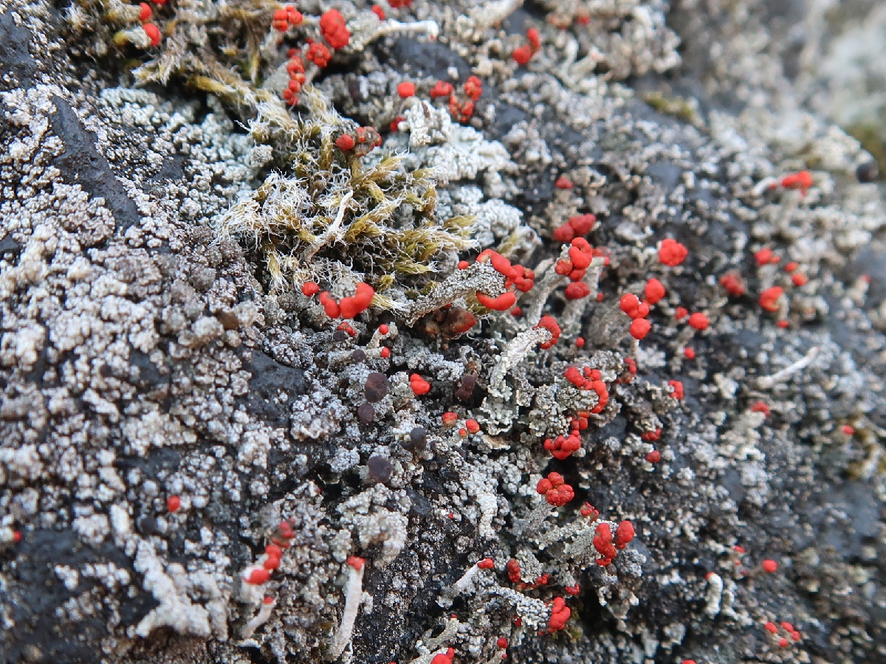

# 北軽井沢のコケと地衣類
2022年5月に、北軽井沢の展望台近くの石碑の上に生えていた、コケと地衣類の写真です。

コケは、葉の先端が白くて細長く尖っていること、場所が標高1000メートル以上の石碑の上であることから、シモフリゴケの仲間(Racomitrium sp.)と考えられます。

地衣類は、樹状で子器が赤いのがアカミゴケの仲間(Cladonia sp.)、同じく樹状で子器が茶色いのがキゴケの仲間(Stereocaulon sp.)と考えられます。

<!--  -->

## Lichens and a moss on a stone monument at Kitakaruizawa
　
