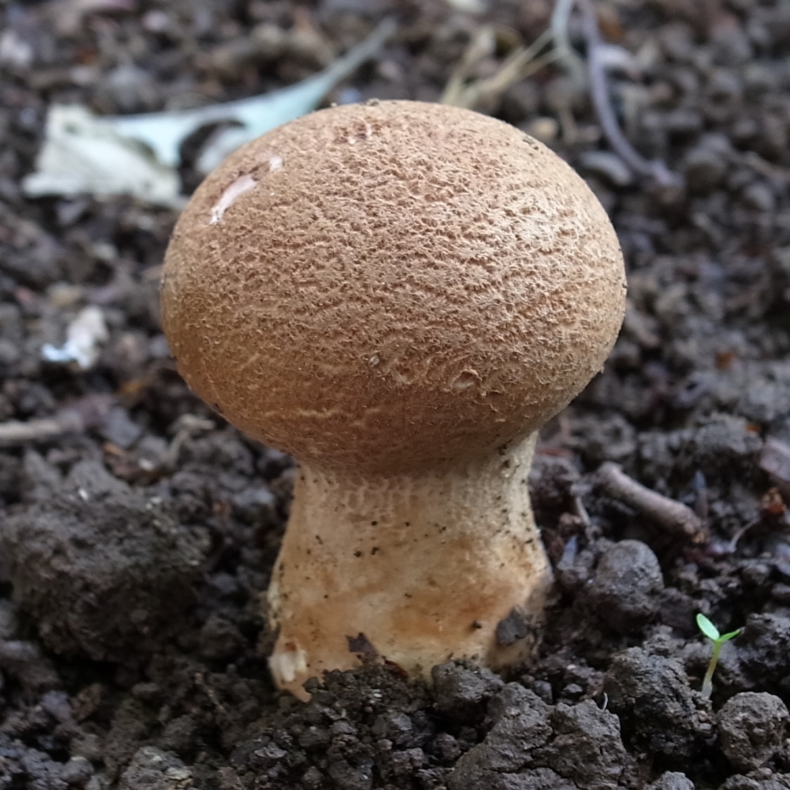

# さいたま市で見たノウタケ
2022年5月に、さいたま市の林の中の遊歩道に生えていた、ノウタケの仲間(Calvatia sp.)の写真です。

梅雨〜秋、林内地上、路傍等に普通に見られるようです。
中身の肉が真っ白であれば、食用になるとのことですが、
私はまだ、そのような状態のものを見たことがありません。

<!--  -->

Calvatia sp. on soil in woods, Saitama, Saitama, Japan.
