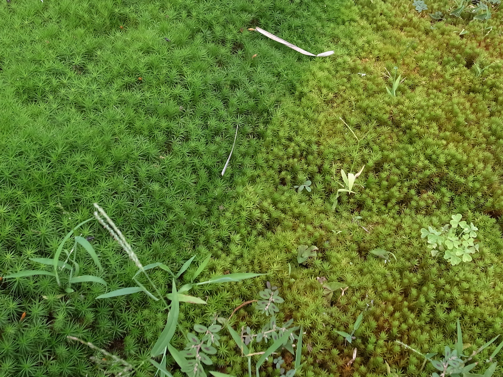

# 日陰と日向のスギゴケ
2022年7月に、川崎市で見た、スギゴケの仲間(Pogonatum sp.)の写真です。
左側のよしずの影になっていた部分は緑色なのに対し、右側の日向の部分は黄緑色をしていました。色の違いがはっきりと見てとれます。これは、このコケの色素の濃度または構成が日陰と日向で異なることを示しています。いつか、このコケの色素分析を行いたいと思っています。

<!--  -->

Pogonatum sp., Kawasaki, Kanagawa, Japan.
