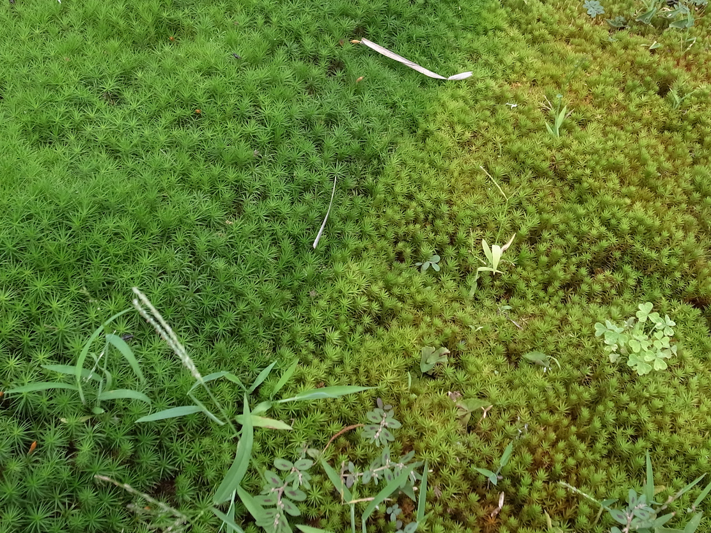

# 高校生向けのコケ研究プログラムへの参加者募集
2022年7月に、川崎市で見た、ウマスギゴケ(Polytrichum commune)の写真です。
左側のヨシズの下で日陰になっている部分は緑色なのに対し、右側の日向の部分は黄緑色をしていました。色の違いがはっきりと見てとれます。この色の違いの原因を明らかにすることを目的とした研究テーマをもとに、私が研究代表者を務める科研費の研究（JSPS科研費 23K02809）の一環として、高校生向けのコケ植物を対象とした分野横断的科学研究プログラムを作成いたしました。この研究プログラムを2025年8月8日（金）〜9日（土）の2日間にわたって実施しますので、ご興味のある高校生のみなさんは奮ってご応募くださいますよう、お願いいたします。

<!--  -->

Polytrichum commune, Kawasaki, Kanagawa, Japan.

＊＊＊＊＊　募集案内　＊＊＊＊＊

a) 開催日時と実施場所（内容）
　8月8日（金）10:00-11:00　川崎市岡本太郎美術館（説明、サンプル採集、測定）
　8月9日（土）10:00-16:00　埼玉大学（講義、同定、測定、議論）
　（8日が悪天候の場合は9日のみ開催）

b) 対象: 高校1、2年生　　c) 募集人数: 10名　　d) 受付: 先着順

e) 応募方法: h.nakajima@mail.saitama-u.ac.jp
宛のEメールに、タイトルを「コケ研究プログラム参加希望」、
本文に1) 氏名、2) 高校名、3) 学年、4) 住所、5) 電話番号を記入して、お送りください。

f) 締め切り: 7月22日（火）（これより前に募集人数に達したら、その時点で締め切り）

g) 参加費: 100円程度（保険代、当日徴収）（交通費と昼食（8月9日に各自持参）代は自己負担）

プログラム責任者・問い合わせ先
中島啓光（なかじま ひろみつ）埼玉大学大学院理工学研究科・ h.nakajima@mail.saitama-u.ac.jp

＊＊＊＊＊＊＊＊＊＊

